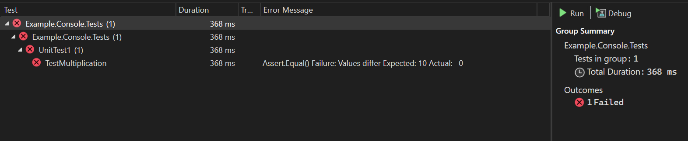
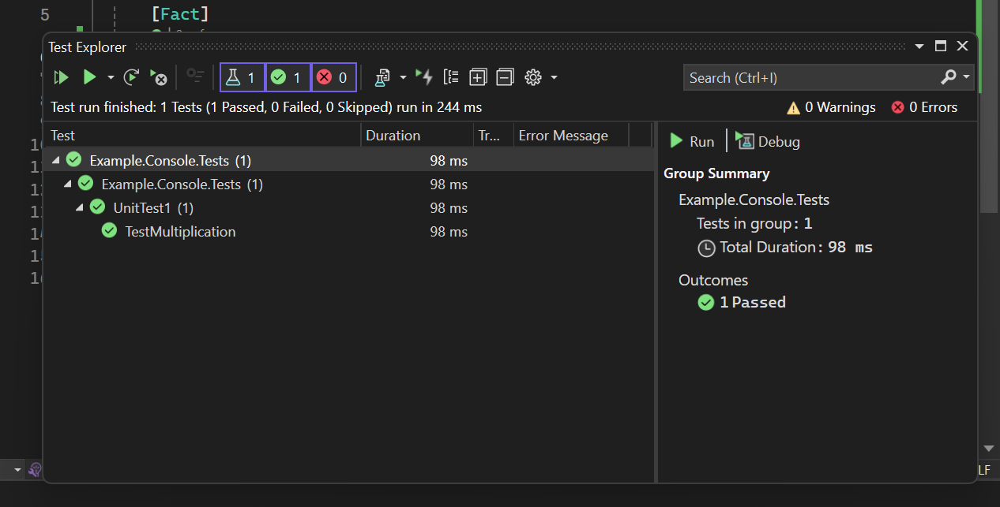

Lập trình với việc khám phá một ngôi nhà tối, trong đó mỗi phòng tượng trưng cho một phần của hệ thống hoặc một tính năng mới.

Viết code mà không có test giống như đi trong bóng tối 

- Bạn không biết chắc mình đang ở đâu, có thể vấp phải chướng ngại vật (bug, thiết kế kém).

Viết test giống như bật đèn
- Nó giúp bạn thấy rõ vấn đề, xác định các lỗi sớm và tránh mắc sai lầm trong thiết kế.
- Refactoring (cải thiện thiết kế mà không thay đổi hành vi) giúp bạn sắp xếp lại đồ đạc trong phòng một cách hợp lý, giúp mọi thứ gọn gàng và dễ di chuyển hơn.
- Sau khi dọn xong một phòng, bạn tiếp tục khám phá phòng tiếp theo, tức là bạn có thể tiếp tục phát triển hệ thống mà không lo lắng về những vấn đề ở phần cũ.
 
# Một số quy tắc cơ bản

TDD dựa trên hai quy tắc cốt lõi:
- Không viết một dòng code nào nếu chưa có một automated test bị fail trước.
- Loại bỏ sự trùng lặp trong code.

Mặc dù chỉ có hai quy tắc đơn giản, nhưng chúng tạo ra những ảnh hưởng sâu rộng đến cách lập trình cá nhân và làm việc nhóm.

- Thiết kế phải được organically:
    - Không thiết kế quá phức tạp ngay từ đầu.
    - Chỉ thêm tính năng khi có nhu cầu thực tế từ test.
    - Nhận phản hồi từ code chạy được, cải tiến dần dần.
=> *Thay vì cố gắng thiết kế ngay một hệ thống hoàn chỉnh, ta phát triển từng bước nhỏ, viết test trước và chỉ mở rộng khi cần thiết*.
- Lập trình viên phải tự viết test của mình: nếu bạn cần test ngay lập tức, bạn không thể chờ ai đó viết hộ, vì quy trình TDD yêu cầu test có trước. 

    => *Điều này giúp lập trình viên hiểu rõ hơn về yêu cầu của tính năng trước khi code*.

- Môi trường phát triển phải hỗ trợ phản hồi nhanh:
    - Mỗi thay đổi nhỏ trong code cần được phản hồi ngay, giúp bạn duy trì dòng chảy phát triển (flow).
    => *Liên quan đến công cụ build test, IDE, CI/CD*.

- Thiết kế phải gồm nhiều thành phần có *loosely coupled, highly cohesive*.

Trong Test-Driven Development (TDD), có một chu kỳ gồm ba bước liên tục được gọi là Red / Green / Refactor. Mỗi bước có một mục đích cụ thể giúp đảm bảo code đúng, dễ hiểu và có thiết kế tốt:
- **Red**: Viết một test bị fail trước, thậm chí có thể không complie được ngay từ đầu.
- **Green**: Viết code tối thiểu để test pass, thậm trí code ban đầu có thể xấu.
- **Refactor**:  Cải thiện code mà vẫn giữ test pass, dọn dẹp code, loại bỏ sự trùng lặp mà không làm test fail.

Red/green/refactor => câu thần chú của TDDs.

Test-Driven Development không phải là gánh nặng, mà là một công cụ để lập trình viên làm việc thông minh hơn và hiệu quả hơn.
- Nếu code được kiểm tra liên tục bằng test tự động, số lượng bug sẽ giảm mạnh, QA không cần dành quá nhiều thời gian tìm và sửa lỗi, mà có thể chủ động cải thiện quy trình.
- Nếu mỗi thay đổi được kiểm tra ngay lập tức qua test tự động, ta tránh được các bất ngờ lớn về sau, Quản lý dự án có thể tự tin hơn trong việc ước tính thời gian và nguồn lực.
- Khi mỗi thay đổi đều đi kèm với một test cụ thể, ta biết chính xác phần nào của hệ thống đang thay đổi. Các cuộc thảo luận kỹ thuật trở nên dễ hiểu hơn vì mọi người đều có chung ngữ cảnh. Lập trình viên có thể làm việc cùng nhau từng phút từng giây, thay vì chỉ họp mỗi ngày hoặc mỗi tuần.
- Nếu ta luôn giữ tất cả test pass, có nghĩa là phần mềm luôn sẵn sàng để release. Doanh nghiệp có thể tạo ra giá trị mới cho khách hàng hàng ngày, thay vì chờ đợi nhiều tháng để có một bản release lớn.

## Fear

Trong lập trình, sợ hãi không phải là điều xấu. Nó là dấu hiệu cho thấy ta đang đối mặt với một vấn đề khó, một tình huống mà ta chưa thể thấy trước toàn bộ giải pháp.

Nhưng vấn đề là nỗi sợ có thể gây ra những phản ứng tiêu cực:

- Làm bạn do dự → Chần chừ, không dám thay đổi code.
- Làm bạn cáu gắt → Dễ bực bội khi mọi thứ không hoạt động như mong đợi.
- Làm bạn ít giao tiếp hơn → Ngại thảo luận, dẫn đến hiểu lầm trong nhóm.
- Làm bạn né tránh phản hồi → Không muốn kiểm tra code, sợ thấy lỗi.

TDD giúp bạn vượt qua nỗi sợ thế nào?
Thay vì để nỗi sợ kiểm soát mình, TDD hướng bạn đến một quy trình chủ động:

✅ Thay vì do dự → Bắt đầu học từ những ví dụ cụ thể
→ Viết một bài test nhỏ giúp bạn xác định vấn đề rõ ràng hơn.

✅ Thay vì né tránh giao tiếp → Giao tiếp rõ ràng hơn
→ Test cases là một cách mô tả chính xác yêu cầu mà không cần giải thích dài dòng.

✅ Thay vì tránh phản hồi → Chủ động tìm kiếm phản hồi
→ Mỗi lần chạy test là một phản hồi tức thì về chất lượng code.

✅ (Còn vấn đề cáu gắt thì bạn phải tự giải quyết 😆)

## Kết luận
Bạn không cần phải là thiên tài hay có ngân sách khổng lồ để tạo ra những khoảnh khắc kỳ diệu. Phương pháp và cơ hội là thứ bạn có thể kiểm soát.

Nếu bạn muốn đạt được những đột phá trong công việc của mình, hãy thực hành phát triển theo hướng kiểm thử (TDD):

✅ Luôn viết một kiểm thử tự động thất bại trước khi viết bất kỳ mã nào

✅ Luôn loại bỏ sự trùng lặp trong mã nguồn

👉 Hai quy tắc đơn giản này có thể giúp bạn làm việc gần với tiềm năng của mình nhất!

# Section I: Money Example

Hãy thử thực hành viết kiểm thử theo các bước sau:

1. Thêm nhanh một kiểm thử mới
2. Chạy tất cả kiểm thử và xác nhận kiểm thử mới bị lỗi
3. Thực hiện một thay đổi nhỏ để kiểm thử vượt qua
4. Chạy lại tất cả kiểm thử và đảm bảo chúng đều thành công
5. Refactor để loại bỏ sự trùng lặp

Những điều có thể khiến bạn bất ngờ
- Mỗi kiểm thử chỉ kiểm tra một phần nhỏ của chức năng
- Mã thay đổi có thể rất nhỏ và thậm chí trông khá xấu xí ban đầu
- Chạy kiểm thử rất thường xuyên – gần như sau mỗi thay đổi nhỏ
- Refactoring bao gồm rất nhiều bước nhỏ li ti

Điểm cốt lõi của TDD không phải là viết mã hoàn hảo ngay từ đầu, mà là phát triển mã một cách có kiểm soát, từng bước nhỏ, với sự hỗ trợ liên tục của kiểm thử tự động.

## Ví dụ
Chúng ta bắt đầu với ý tưởng của Ward tại WyCash về đối tượng tiền đa tiền tệ. Ban đầu, báo cáo chỉ bao gồm số lượng cổ phiếu và giá mà không có thông tin tiền tệ:

```code
Instrument    Shares    Price    Total
IBM           1000      25       25000
GE            400       100      40000
Total: 75000

```

Khi báo cáo cần hỗ trợ đa tiền tệ, chúng ta bổ sung thông tin đơn vị tiền tệ:

```code
Instrument    Shares    Price    Total
IBM           1000      25 USD   25000 USD
Novartis      400       150 CHF  40000 CHF
Total: 75000 USD
```

Và ta cũng cần một bảng tỷ giá chuyển đổi, ví dụ:
```code
From    To      Rate
CHF     USD     1.5
```

Để đảm bảo hệ thống xử lý đúng báo cáo đa tiền tệ, ta cần code phải có những hành vi sau:

- Cộng số tiền ở các đơn vị khác nhau: Phải có khả năng cộng các số tiền từ hai loại tiền tệ khác nhau và chuyển đổi kết quả dựa trên bảng tỷ giá.
- Nhân số tiền với số lượng: Phải có khả năng nhân một số tiền (giá mỗi cổ phiếu) với số lượng cổ phiếu để tính ra tổng số tiền.

Để thực hiện bài toán này, chúng ta sẽ tạo todo list để focus vào những cái cần làm, và biết được khi nào chúng ta hoàn thành:

```code
To do:
$5 + 10 CHF = $10 if CHF:USD is 2:1
$5 * 2 = $10
```

Câu hỏi đặt ra là: "Chúng ta cần đối tượng nào trước?"

Nhưng đây là một câu hỏi đánh lừa, vì trong Test-Driven Development (TDD), ta không bắt đầu bằng việc thiết kế đối tượng ngay. Thay vào đó, ta bắt đầu bằng viết một bài kiểm thử trước.

Vậy kiểm thử nào nên viết trước?
Nhìn vào danh sách to-do:

Hãy nhớ *Start small or not at all* và chúng ta thấy rằng:
$5 + 10 CHF = $10 nếu tỷ giá CHF:USD là 2:1 → Đây là một phép tính liên quan đến nhiều loại tiền tệ và có thể phức tạp.

$5 * 2 = $10 → Đây là một phép nhân đơn giản hơn.
👉 Vì nguyên tắc trong TDD là "bắt đầu với bước nhỏ nhất có thể", ta sẽ chọn kiểm thử phép nhân trước.

=> Trong TDD, thay vì cố gắng thiết kế một API "thực tế" và phức tạp ngay từ đầu, ta nên bắt đầu với một API đẹp, dễ hiểu, dễ dùng nhất, rồi điều chỉnh dần khi phát triển.

Ở đây là ví dụ của multiplication:

```csharp
    [Fact]
    public void TestMultiplication()
    {
        Dollar five = new(5);
        five.Times(2);
        Assert.Equal(10, five.Amount);
    }
```

Chúng ta có thể thấy có một số điểm chưa tốt ở đây:
- Dùng public fields → Không tuân theo nguyên tắc đóng gói (encapsulation).
- Có thể gây side-effects → Code có thể làm thay đổi trạng thái ngoài dự kiến.
- Dùng số nguyên (int) để biểu diễn tiền → Có thể gây lỗi làm tròn.

Nhưng chúng ta sẽ làm từng bước nhỏ, mặc dù code có thể sẽ cẩu thả nhưng chúng ta hãy ghi lại sự cẩu thả đó, và tiếp tục. Chúng ta có một bài kiểm thử thất bại và muốn nó chạy thành công càng nhanh càng tốt.

Chúng ta sẽ sửa lại to-do:

```code
To do:
$5 + 10 CHF = $10 if CHF:USD is 2:1
$5 * 2 = $10
Make “amount” private
Dollar side-effects?
Money rounding?
```

Nhưng trước hết, bài test trên vừa được viết nhưng chưa thể biên dịch được do thiếu các thành phần cơ bản trong code:

- Chưa có class Dollar → Cần tạo một class có tên Dollar.
- Chưa có constructor → Cần tạo constructor cho Dollar(int amount).
- Chưa có phương thức Times(int) → Cần tạo một method Times(int multiplier).
- Chưa có field amount → Cần khai báo một biến amount trong class Dollar.

Vì vậy, cần thêm tối thiểu các thành phần để code biên dịch được, dù nó chưa chạy đúng, chúng ta sẽ làm từng bước một

- Tạo class Dollar
- Bây giờ sẽ cần contructor nhưng ko làm bất cứ điều gì, chỉ để biên dịch được đã.
```csharp
Dollar
    Dollar(int amount) {
    }
```
- Tương tự, tạo method Times
```csharp
Dollar
    void Times(int multiplier) {
    }
```

- Cuối cùng thêm field Amount:
```csharp
Dollar
    int amount;
```

Bây giờ, chạy test và xem nó thất bại → Mục tiêu của bước này không phải làm đúng, mà là để test có thể chạy.



Chúng ta nhìn thấy màu đỏ không ưa thích =)). Bởi kết quả mong đợi là 10 nhưng nó lại nhận về 0.

Nhưng đây không phải điều xấu. Bởi vì:

✅ **Lỗi là tiến bộ → Vì nó giúp ta thấy rõ điều gì chưa đúng**.

✅ **Có lỗi nghĩa là ta đã có thước đo cụ thể → Chúng ta biết cần sửa gì**.

Điều đó tốt hơn là chỉ mơ hồ biết rằng chúng ta đang thất bại.

Chúng ta đã chuyển đổi vấn đề phức tạp thành vấn đề nhỏ. Ban đầu, bài toán rất rộng: “Làm sao để hỗ trợ đa tiền tệ?”, nhưng bây giờ, vấn đề đã rõ ràng hơn: “Làm sao để test này chạy đúng?”

Từ đó vấn đề sẽ đơn giản hơn, giảm nỗi sợ hãi khi lập trình.

Chúng ta chưa cần code đẹp, tối ưu, hay “đúng chuẩn” ngay. Ưu tiên hàng đầu: Viết code đơn giản nhất có thể để test pass. Sau khi test pass, chúng ta sẽ refactor (cải tiến code).

Sau đây là thay đổi nhỏ nhất mà tôi có thể tưởng tượng có thể khiến bài kiểm tra của chúng tôi vượt qua:

```csharp
Dollar
    int Amount= 10;
```

Và bài kiểm tra của chúng ta đã có màu xanh hy vọng :D




Chúng ta đã làm cho test pass! 🟢 Nhưng đừng vội mừng! Code hiện tại chỉ pass được đúng một bộ dữ liệu (ví dụ: 5 * 2 = 10). Nhưng nếu thử với giá trị khác (6 * 2 hoặc 5 * 3), code sẽ thất bại ngay lập tức => Ta cần tổng quát hóa (generalize) để xử lý mọi trường hợp.

TDD không chỉ là viết test và làm cho test pass → Cần có bước refactor!

🔄 Chu trình TDD đúng chuẩn:

1. Viết một test nhỏ

2. Chạy test → Phải thất bại (Red Bar) ❌

3. Sửa code tối thiểu để test pass (Green Bar) ✅

4. Chạy lại test để kiểm tra

5. Refactor (cải tiến code, loại bỏ trùng lặp, tổng quát hóa)


